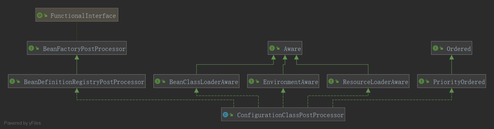
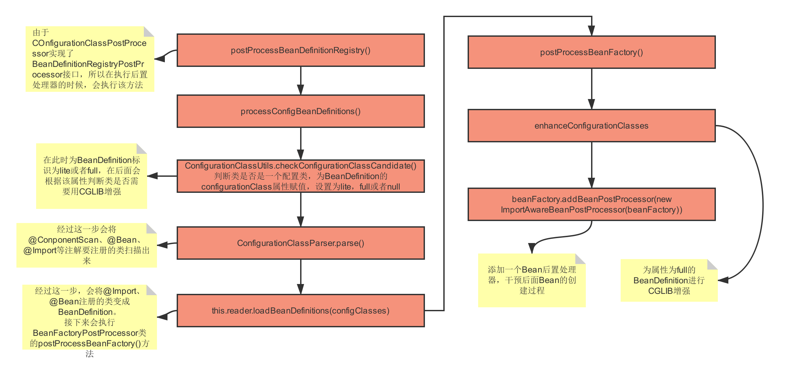
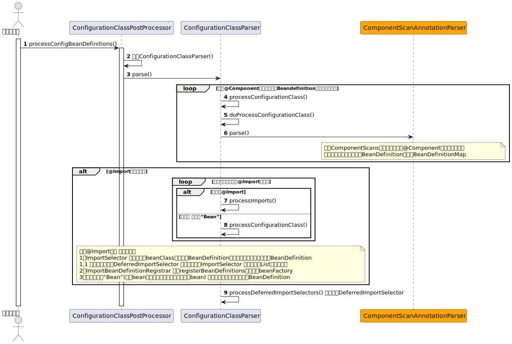

# refresh()

```java

@Override
	public void refresh() throws BeansException, IllegalStateException {
		synchronized (this.startupShutdownMonitor) {
			// Prepare this context for refreshing.
			// 一些前置环境准备 比如 启动时间等等 容器状态 不重要
			prepareRefresh();

			// 先刷新beanFactory 后拿到 beanFactory
			// Tell the subclass to refresh the internal bean factory.
			ConfigurableListableBeanFactory beanFactory = obtainFreshBeanFactory();

			// 准备bean工厂
			// 非常重要 主要是设置 一些 spring内置的 bean后置处理器。
			// 例如非常重要的 xxAwareProcessor 就是给 实现了xxxAware接口的bean中注入
			// 一些 属性 例如application、Environment等等
			// Prepare the bean factory for use in this context.
			prepareBeanFactory(beanFactory);

			try {
				// Allows post-processing of the bean factory in context subclasses.
				// 这是一个空方法 后面可能会有用
				postProcessBeanFactory(beanFactory);

				// Invoke factory processors registered as beans in the context.
				// 执行beanFactory 的后置处理器。设置好beanFactory以便于后续 来生成bean
				/**
				 * 非常重要 
				 *  其中有个非常重要的ConfigurationClassPostProcesser 完成了配置类的解析 扫描bd
				 */
				invokeBeanFactoryPostProcessors(beanFactory);

				// Register bean processors that intercept bean creation.
				//将所有的后置处理器注册到容器中 各种各样的
				registerBeanPostProcessors(beanFactory);

				// Initialize message source for this context.
				// 国际化相关处理
				initMessageSource();

				// Initialize event multicaster for this context.
				// 事件相关处理
				initApplicationEventMulticaster();

				// Initialize other special beans in specific context subclasses.
				onRefresh();

				// Check for listener beans and register them.
				registerListeners();

				// Instantiate all remaining (non-lazy-init) singletons.
				/**
				 *  核心 非常重要。bean的创建都在这里面
				 */
				finishBeanFactoryInitialization(beanFactory);

				// Last step: publish corresponding event.
				finishRefresh();
			}

			catch (BeansException ex) {
				if (logger.isWarnEnabled()) {
					logger.warn("Exception encountered during context initialization - " +
							"cancelling refresh attempt: " + ex);
				}

				// Destroy already created singletons to avoid dangling resources.
				destroyBeans();

				// Reset 'active' flag.
				cancelRefresh(ex);

				// Propagate exception to caller.
				throw ex;
			}

			finally {
				// Reset common introspection caches in Spring's core, since we
				// might not ever need metadata for singleton beans anymore...
				resetCommonCaches();
			}
		}
	}

```


#  执行beanFactory的后置处理器

>  invokeBeanFactoryPostProcessors(beanFactory);
>
> 回想前面初始化的时候向beanFactory里面注入了一个org.springframework.context.annotation.internalConfigurationAnnotationProcessor 



>  从类图结构可以看到这个后置处理器有以下功能
>
> 1、BeanDefinitionRegistryPostProcessor 带有注册beanDefinition功能的beanFactory后置处理器
>
> 2、继承了三个Aware接口，会通过这些Aware接口传入相关实例
>
> 3、PriorityOrdered 代表这个bean后置处理器会优先执行。因为解析配置的时候可能扫描出来新的beanFactory后置处理器

## 执行顺序

> 1、执行BeanDefinitionRegistryPostProcessor 后置处理器
>
> 	- 执行实现了PriorityOrdered 的BeanDefinitionRegistryPostProcessor
> 	- 执行实现了Ordered 的BeanDefinitionRegistryPostProcessor
> 	- 执行前面扫描出来的 BeanDefinitionRegistryPostProcessor，并且直到没有新的BeanDefinitionRegistryPostProcessor被扫描出来
>
> 2、执行BeanFactoryPostProcessor  后置处理器
>
> - 优先执行一下BeanDefinitionRegistryPostProcessor（因为它实现了BeanFactoryPostProcessor）
> - 执行实现了PriorityOrdered 的BeanFactoryPostProcessor
> - 执行实现了Ordered 的BeanFactoryPostProcessor
> - 执行剩下的所有普通的 BeanFactoryPostProcessor


## 最核心的 ConfigurationAnnotationProcessor 的BeanDefinitionRegistryPostProcessor执行

> 这里就是就是去解析配置类。最重要的



#### 解析配置类全过程

