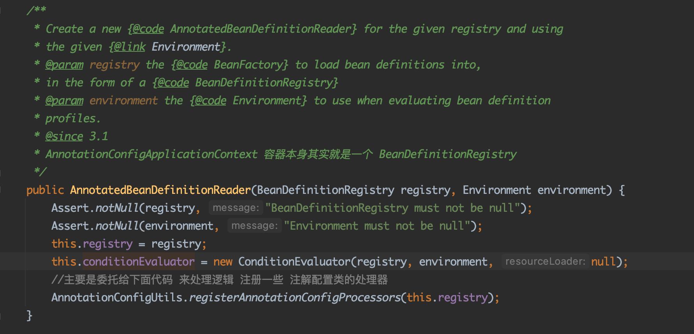

# 前言

> 测试代码
>
> 1、启动配置类解析AppConfig.class
>
> 2、从IOC获取IndexDao 这个类的bean对象

```java

@Configuration
@ComponentScan("这里是包名")
public class AppConfig {
}

@Repository
public class IndexDao {	
}


public class Test {

	public static void main(String[] args) {

		// 1、父类的构造方法 -- 创建环境
		// 2、创建AnnotatedBeanDefinitionReader(简称BDR) 并委托完成下面逻辑AnnotationConfigUtils.registerAnnotationConfigProcessors
		// 		2.1 设置 DependencyComparator  AutowireCandidateResolver
		// 		2.2 设置6大RootBeanDefinition对象 并注册到BeanDefinitionMap 中
		// 3、创建 ClassPathBeanDefinitionScanner
		//初始化beanfactory 环境
		AnnotationConfigApplicationContext annotationConfigApplicationContext = new AnnotationConfigApplicationContext(AppConfig.class);
		IndexDao indexDao = annotationConfigApplicationContext.getBean(IndexDao.class);
		System.out.println(indexDao.hashCode());
  }
}
```


>  从 new AnnotationConfigApplicationContext(AppConfig.class) 开始


> 

#  DefaultListableBeanFactory

> 就是IOC 容器本身。
>
> 可以完成beanDefinition的注册
>
> 可以完成bean的生成


# AnnotatedBeanDefinitionReader 初始化

> AnnotatedBeanDefinitionReader 职责用来解析注解标注的Bean为BeanDefinition



## 注册创世纪的后置处理器

>  AnnotationConfigUtils.registerAnnotationConfigProcessors(this.registry);


### 1 配置类解析后置处理器

>  org.springframework.context.annotation.internalConfigurationAnnotationProcessor

>  非常重要，用来解析处理配置类
>
> 配置类的定义：
>
> 1、@Import
>
> 2、@Configuration
>
> 3、@ComponentScan


### 2 负责处理@EventListener

>  org.springframework.context.event.internalEventListenerFactory


>  org.springframework.context.event.internalEventListenerProcessor


### 3 用于解析@AutoWired

>  org.springframework.context.annotation.internalAutowiredAnnotationProcessor


org.springframework.context.annotation.internalCommonAnnotationProcessor

> 它负责解析
> `@Resource、@WebServiceRef、@EJB`三个注解。
> 这三个注解都是定义在`javax.*`包下的注解，属于java中的注解。

org.springframework.context.annotation.internalRequiredAnnotationProcessor

> 解析@Required，
> 注解为为了保证所对应的属性必须被设置


# ClassPathBeanDefinitionScanner 初始化

> 用来扫描ClassPath下的beanDefinition的
>
> 但是启动的时候初始化的ClassPathBeanDefinitionScanner 并不是spring解析配置类的时候使用的。
>
> 他的作用是在启动时代码指定扫描一个包时使用

```java
AnnotationConfigApplicationContext annotationConfigApplicationContext = new AnnotationConfigApplicationContext(AppConfig.class);
annotationConfigApplicationContext.scan("xxx.com");

```


# 注册我们的AppConfig.class


就是利用前面AnnotatedBeanDefinitionReader 将AppConfig.class 包装成一个BeanDefinition注册到BeanDeiinitionMap中去


# refresh()

> 真正的启动我们的spring。
>
> 后续spring自动的解析配置类
>
> 扫描beanDefinition
>
> 生成bean
>
> 自动注入
>
> aop代理
>
> 生命周期回调
>
> 发布事件
>
> ......